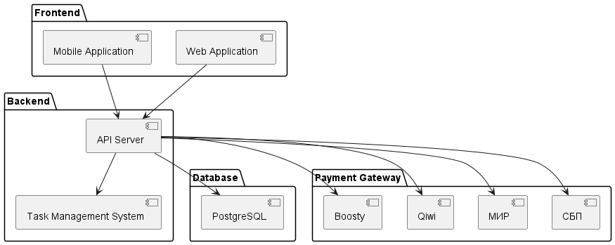

= SPEC-1: Приложение для кооперации разработчиков игр и пользователей
:sectnums:
:toc:

== Описание

Идея создания этого приложения возникла из необходимости объединить разработчиков игр в команды, упростить процесс управления задачами и предоставить пользователям возможность оценивать, обсуждать и финансово поддерживать проекты.
Приложение предназначено для двух основных аудиторий: разработчиков игр и пользователей, заинтересованных в поддержке игровых проектов.

== Требования

=== Must Have

* Регистрация пользователей и создание профилей.
* Создание и управление карточками проектов.
* Возможность подачи заявок разработчиками для участия в проекте.
* Система управления задачами для команд (аналог Jira).
* Возможность пользователей оценивать проекты.
* Возможность пользователей оставлять комментарии и участвовать в обсуждениях.
* Форумы в рамках каждого проекта.
* Система финансовой поддержки проектов.

=== Should Have

* Уведомления для разработчиков и пользователей.
* Поиск проектов и разработчиков по различным критериям.
* Интеграция с популярными платежными системами для поддержки проектов.

=== Could Have

* Аналитика и отчеты для создателей проектов.
* Система значков и достижений для разработчиков и активных пользователей.
* Мобильное приложение.

=== Won't Have

* Встроенные инструменты для разработки игр.
* Система чатов в реальном времени.

== Архитектура

Для реализации всех требований мы используем многоуровневую архитектуру. Основные компоненты включают в себя:

1. Frontend: Веб-приложение и мобильное приложение (для Could Have) для взаимодействия с пользователями.
2. Backend: Серверное приложение для обработки логики приложения, управления данными и API.
3. Database: База данных для хранения информации о пользователях, проектах, задачах и поддержке.
4. Task Management System: Встроенная или интегрированная система управления задачами, аналогичная Jira.
5. Payment Gateway: Интеграция с популярными платежными системами для поддержки проектов.

=== Компоненты

==== Frontend

*Язык и фреймворк:* React.js для веб-приложения и React Native для мобильного приложения.

*Функциональность:*

1. Регистрация и авторизация пользователей.
2. Профили пользователей.
3. Создание и управление карточками проектов.
4. Интерфейс для подачи заявок на участие в проектах.
5. Система управления задачами для команд.
6. Оценка проектов, комментарии, форумы и обсуждения.
7. Интерфейс для финансовой поддержки проектов.

==== Backend

*Язык и фреймворк:* Java с использованием Spring Framework.

*Функциональность:*

1. API для фронтенда.
2. Управление пользователями и проектами.
3. Управление задачами и командной работой.
4. Обработка оценок, комментариев и обсуждений.
5. Интеграция с платежными системами.
6. Уведомления и оповещения.

==== Database

*Тип:* Реляционная база данных (PostgreSQL).

*Схема данных:*

1. Таблица пользователей (users): ID, имя, email, пароль, профильная информация.
2. Таблица проектов (projects): ID, название, описание, создатель, статус, дата создания.
3. Таблица задач (tasks): ID, проект, описание, ответственный, статус, приоритет.
4. Таблица оценок (ratings): ID, проект, пользователь, оценка.
5. Таблица комментариев (comments): ID, проект, пользователь, текст, дата.
6. Таблица финансовой поддержки (support): ID, проект, пользователь, сумма, дата.

==== Task Management System

*Вариант 1:* Встроенная система управления задачами на основе существующих библиотек.

*Вариант 2:* Интеграция с внешними сервисами, такими как Jira или Trello.

==== Payment Gateway

*Популярные системы:* Мир, СБП, Qiwi, Boosty.

=== Схема компонентов

== Реализация

Шаги по реализации

1. *Подготовка среды разработки*

* Настройка репозитория кода (например, GitHub или GitLab).

* Создание базовой структуры проекта для фронтенда и бэкенда.

* Настройка CI/CD пайплайнов для автоматического тестирования и деплоя.

2. *Разработка Frontend*

* Создание начального проекта с использованием React.js и React Native.
* Реализация страниц регистрации и авторизации.
* Разработка интерфейса профилей пользователей.
* Создание страниц для создания и управления карточками проектов.
* Реализация системы подачи заявок разработчиками.
* Разработка интерфейса для управления задачами команд.
* Реализация системы оценок, комментариев и форумов.
* Создание интерфейса для финансовой поддержки проектов.

3. *Разработка Backend*

* Настройка проекта с использованием Spring Framework.
* Реализация API для регистрации и авторизации пользователей.
* Разработка API для создания и управления проектами.
* Реализация API для подачи заявок разработчиками.
* Разработка API для управления задачами команд.
* Реализация API для оценок, комментариев и форумов.
* Интеграция с платежными системами (Stripe и PayPal).
* Реализация системы уведомлений и оповещений.

4. *Настройка базы данных*

* Создание схемы базы данных в PostgreSQL.
* Реализация миграций для создания таблиц пользователей, проектов, задач, оценок, комментариев и финансовой поддержки.

5. *Интеграция Task Management System*

* Встроенная система управления задачами: разработка необходимого функционала внутри приложения.
* Интеграция с внешними сервисами (Jira или Trello): настройка API и синхронизация данных.

6. *Интеграция Payment Gateway*

* Настройка аккаунтов в Stripe и PayPal.
* Реализация платежных процессов на стороне бэкенда.
* Настройка уведомлений и обработка успешных и неудачных транзакций.

7. *Тестирование и отладка*

* Написание и выполнение юнит-тестов и интеграционных тестов.
* Тестирование всех функций приложения.
* Отладка и исправление обнаруженных ошибок.

8. *Развертывание и мониторинг*

* Настройка серверов для хостинга приложения (например, AWS, Heroku или другой провайдер).
* Развертывание фронтенда и бэкенда на серверы.
* Настройка мониторинга и логирования для отслеживания работы приложения.